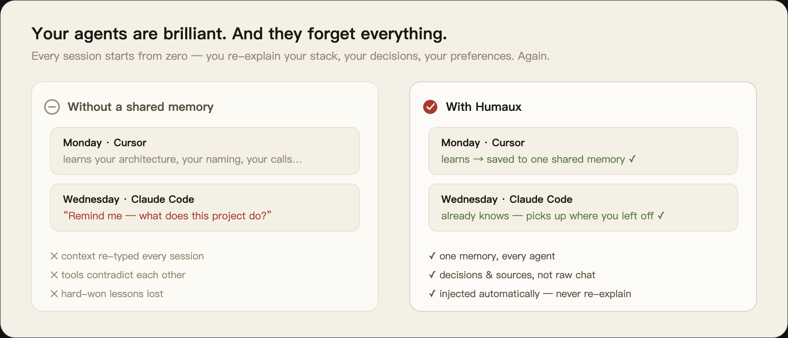
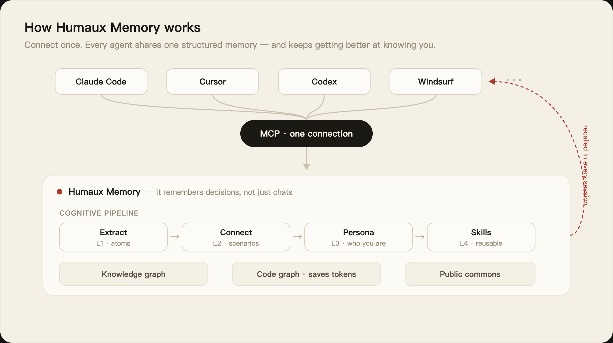
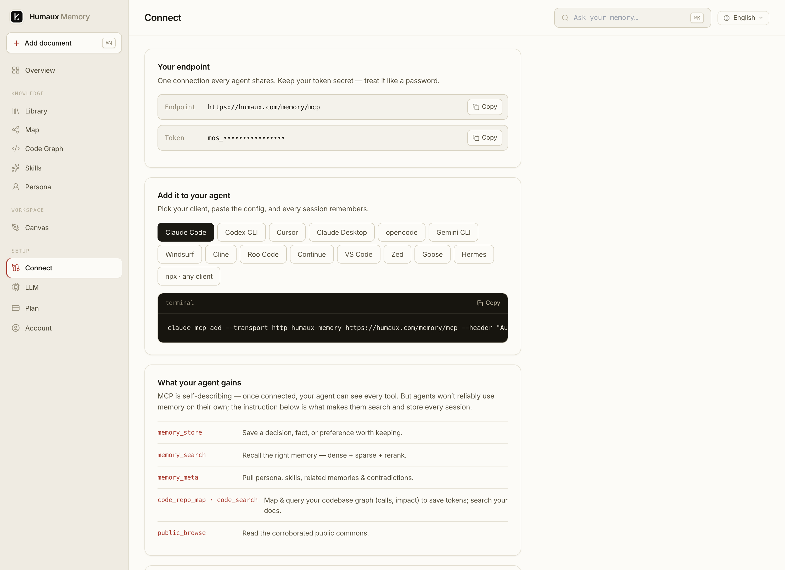

<div align="center">


# Humaux

**Built around the human.**

Human-centered auxiliary tools for AI agents — completing the whole chain of
AI automation *around people, not over them.*

English · [简体中文](README.zh.md) · [Français](README.fr.md) · [Italiano](README.it.md)

[**humaux.com**](https://humaux.com) · [Humaux Memory](https://humaux.com/humauxmemory)

</div>

---

> ### ⚡ Set up in one message
> Tell your agent: **“Read https://github.com/luogangan7-lgtm/humaux and set up Humaux Memory for me.”**
> It will follow **[SETUP.md](SETUP.md)** and configure itself into the right file —
> creating `CLAUDE.md` / `AGENTS.md` / `.cursor/rules` if they don't exist yet.
> Prefer to do it by hand? See [Connect in one line](#connect-in-one-line).

## What is Humaux

Agents are getting capable. What they lack is **continuity** — they forget who you
are, what you decided, and what they already learned, every time a session ends.

Humaux builds the layer that stays. Not a bigger model, not another agent — the
**human-shaped memory and tooling** your agents plug into, so the whole chain of
work is built around you.

<div align="center">

</div>

Our roadmap runs in three stages:

| Stage | Product | Status |
|---|---|---|
| **1 · Memory** | One shared, structured memory for every agent | **Live** |
| 2 · Content pipelines | Turn raw work into reusable, structured knowledge | In progress |
| 3 · Automation chain | Close the loop from intent to outcome | Planned |

---

## Humaux Memory

> The second brain your agents share.

One persistent, structured memory that every agent — **Claude Code, Cursor, Codex,
Windsurf, Gemini CLI, Cline** and more — connects to over [MCP](https://modelcontextprotocol.io).
Store once; recalled everywhere. It remembers **decisions, not just chats** —
structured, corroborated, and returned with its sources.

<div align="center">

</div>

### What it does

| | |
|---|---|
| **One memory, every agent** | Connect once with MCP. Every tool you use shares the same second brain. |
| **Cognitive layering** | Raw notes are distilled through a pipeline — atoms → scenarios → persona → reusable skills — instead of piling up as a flat log. |
| **Knowledge graph** | Memories link into a graph; contradictions are resolved with a dual time-axis so the newest fact wins and history is kept. |
| **Code graph** | Push the code you're working on and query its structure — callers, dependencies, impact — instead of re-reading whole files. Saves tokens. |
| **Auto-built persona** | Humaux learns who you are and how you work, and injects that into every connected agent — so you never re-explain yourself. |
| **Public commons** | Opt-in shared knowledge, served only once independently corroborated. |
| **Bring your own model** | Use your own LLM and embedding provider. Your data, encrypted and yours to export. |

> Every tool and its **mandatory** usage rules: **[TOOLS.md](TOOLS.md)** · self-install guide: **[SETUP.md](SETUP.md)**.

### Connect in one line

Claude Code:

```bash
claude mcp add --transport http humaux-memory https://humaux.com/memory/mcp \
  --header "Authorization: Bearer <your-token>"
```

Any other MCP client (Cursor, Codex, Windsurf, …):

```bash
npx -y humaux-memory-mcp --token <your-token>
```

Grab your token at **[humaux.com → Connect](https://humaux.com/humauxmemory)**. New tools
ship server-side, so your agents pick them up automatically — no reinstall.

<div align="center">

<br/><sub>The in-product Connect screen — one endpoint, every client, token masked.</sub>
</div>

### Teach your agent to use it

Memory works best when the agent reaches for it on its own. Paste this into your
agent's always-on rules (`CLAUDE.md`, `AGENTS.md`, `.cursor/rules`, …):

```text
At the start of a session, search memory for relevant context before answering.
Store decisions, preferences, fixes, and project progress the moment you learn them.
Prefer corroborated memories; don't ask for what you can recall.
```

---

## Principles

- **Around the human.** Tools augment you; they don't replace your judgment or hide what they did.
- **Remember decisions, not transcripts.** Structure and sources over raw logs.
- **Honest by default.** Corroborated knowledge is marked as such; single-source claims are treated with care.
- **Your data is yours.** Bring your own model; export any time.

---

## Links

- 🌐 Website — **[humaux.com](https://humaux.com)**
- 🧠 Humaux Memory — **[humaux.com/humauxmemory](https://humaux.com/humauxmemory)**
- 📦 Connector — [`humaux-memory-mcp`](https://www.npmjs.com/package/humaux-memory-mcp) on npm

<div align="center">
<sub>© Humaux · Built around the human.</sub>
</div>
